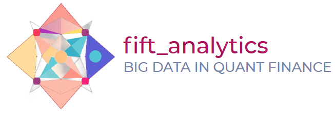

<p align="center">
    <a href=""></a>
</p>
<p align="center">
    <em>IFT Fixed Income GILTS Analytics Python Package</em>
</p>

|||||
|--------------------------------|--------------------------------------|---------|-----|
|**Build**||**Documentation**|[](https://iftucl.github.io/fift_analytics/)|
|**Unit Test**|[](https://github.com/iftucl/fift_analytics/actions/workflows/test.yml)|
|**Coverage**|[](https://codecov.io/gh/iftucl/fift_analytics)|
|**Linting**||

# fift_analytics

**IFT  Fixed Income Analytics (FIFT)** is a python package that provides abstraction functionalities used model the GILTS Sovereign Bonds. This is used for didactical purposes in the Big Data in Quantitative Finance module @uclift.

## Main Features

- zero coupon bonds : abstraction to model gilts zero coupon bonds.

## How to get

The artifacts of this repository are not yet pushed to pypi.
However, we provide some options to install and use this python library:

### whl built

the .whl and tar files are available for download on the Build Pipeline within this repo. As the package has not yet reached a stable state we won't publish to pypi.

### poetry

from the command line of your project:

```bash

poetry add git+https://github.com/iftucl/fift_analytics.git

```